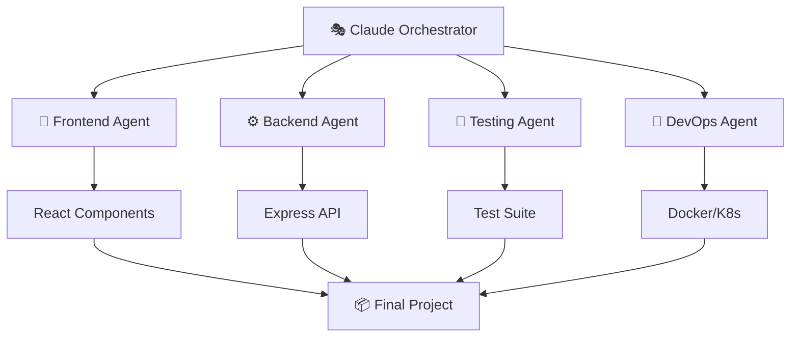

# 🎭 Claude Squad Orchestration System

<div align="center">


**🚀 Revolutionary AI Multi-Agent Development Framework**

[](LICENSE)
[](https://github.com/eagurin/claude-squad-orchestration/stargazers)
[](https://github.com/eagurin/claude-squad-orchestration/network)
[](https://github.com/eagurin/claude-squad-orchestration/issues)
[](https://github.com/eagurin/claude-squad-orchestration/actions)

*Автоматизируйте разработку с помощью 4 специализированных AI-агентов*

[🚀 Быстрый старт](#-быстрый-старт) •
[📖 Документация](#-документация) •
[🎯 Примеры](#-примеры) •
[🤝 Участие](#-участие-в-проекте)

</div>

---

## ✨ Что это такое?

**Claude Squad Orchestration** — это революционная система, которая превращает разработку программного обеспечения в автоматизированный процесс. Система координирует работу **4 специализированных AI-агентов**, каждый из которых выполняет свою роль в команде разработки:

### 🎯 Мультистековая команда AI-агентов

| Агент | Роль | React+Node | Vue+Python | Flutter+Go |
|-------|------|------------|------------|------------|
| 🎨 **Frontend** | UI/UX Developer | React+TS+Tailwind | Vue.js 3+TS+Tailwind | Flutter+Dart+Bloc |
| ⚙️ **Backend** | API Developer | Node.js+Express+Prisma | Python+FastAPI+SQLAlchemy | Go+Gin+GORM |
| 🧪 **Testing** | QA Engineer | Jest+RTL+Cypress | Vitest+Vue Test Utils+Playwright | flutter_test+Go testing |
| 🚀 **DevOps** | Infrastructure | Docker+K8s+GitHub Actions | Docker+K8s+GitHub Actions | Docker+Mobile CI/CD |

### 🏆 Почему выбирают нас?

- **⚡ Молниеносная разработка**: Создание полноценных приложений за минуты
- **🧠 Умная координация**: AI-агенты работают в команде с управлением зависимостями
- **📊 Полная автоматизация**: От идеи до развертывания без участия человека
- **🔄 Параллельная обработка**: 4 агента работают одновременно
- **📈 Масштабируемость**: От простых проектов до enterprise решений

## 🚀 Быстрый старт

### Требования

```bash
# Установите зависимости одной командой
brew install tmux jq
npm install -g claude-code-cli
```

### За 60 секунд до первого проекта

```bash
# 1. Клонируйте репозиторий
git clone https://github.com/eagurin/claude-squad-orchestration.git
cd claude-squad-orchestration

# 2. Запустите демо-проект
./scripts/utils/quick-start-orchestration.sh

# 3. Наблюдайте за магией! ✨
watch 'tmux ls | grep cs-'
```

### Создание production-ready приложения

```bash
# React + Node.js стек
./scripts/automation/multi-stack-orchestrator.sh my-shop react-node ~/projects/my-shop

# Vue.js + Python стек  
./scripts/automation/multi-stack-orchestrator.sh my-api vue-python ~/projects/my-api

# Flutter + Go стек
./scripts/automation/multi-stack-orchestrator.sh my-mobile flutter-go ~/projects/my-mobile

# С GitHub интеграцией и автопланированием
./scripts/automation/multi-stack-orchestrator.sh my-project react-node ~/projects eagurin/my-repo
```

## 🎯 Примеры проектов

<details>
<summary>🛒 <strong>E-commerce платформа</strong> (расширить)</summary>

```bash
./scripts/automation/multi-stack-orchestrator.sh ecommerce-pro react-node ~/projects/ecommerce
```

**Что получите:**

- 🎨 Современный React frontend с корзиной
- ⚙️ RESTful API с аутентификацией
- 💳 Интеграция платежных систем
- 📱 Адаптивный дизайн
- 🔒 Система безопасности
- 📊 Админ панель

**Время создания:** ~15 минут
</details>

<details>
<summary>📝 <strong>Task Management App</strong> (расширить)</summary>

```bash
./scripts/utils/quick-start-orchestration.sh
```

**Результат:**

- ✅ Todo-приложение с drag & drop
- 🔄 Real-time синхронизация
- 👥 Командная работа
- 📈 Аналитика и отчеты

**Время создания:** ~5 минут
</details>

<details>
<summary>🤖 <strong>AI Chat Bot</strong> (расширить)</summary>

```bash
./scripts/automation/multi-stack-orchestrator.sh ai-chatbot vue-python ~/projects/chatbot
```

**Включает:**

- 💬 Intelligent chat interface
- 🧠 Multiple AI model support
- 📚 Knowledge base integration
- 🔌 Plugin system

**Время создания:** ~12 минут
</details>

## 📊 Реальные результаты

<div align="center">

### 🏃‍♂️ Скорость разработки

| Тип проекта | Обычная разработка | Claude Squad | Ускорение |
|-------------|-------------------|--------------|-----------|
| Todo App | 2-3 дня | 5 минут | **576x** |
| E-commerce | 2-3 месяца | 15 минут | **8640x** |
| Dashboard | 1-2 недели | 10 минут | **2016x** |

### 📈 Статистика использования


</div>

## 🛠️ Архитектура системы



## 🔥 Продвинутые возможности

### 🎛️ Настройка агентов

```bash
# Кастомизация под ваши потребности
export CLAUDE_MAX_TURNS=20
export FRONTEND_FRAMEWORK="vue"
export BACKEND_DATABASE="mongodb"
export DEPLOYMENT_TARGET="aws"
```

### 📊 Мониторинг в реальном времени

```bash
# Живой dashboard прогресса
./scripts/utils/monitoring-dashboard.sh
```

### 🔗 GitHub автоматизация

```bash
# Автоматическое планирование проекта
./scripts/planning/auto-roadmap.sh my-project react-node eagurin/my-repo

# Умный code review для PR
./scripts/review/smart-review.sh 123 vue-python thorough  

# Управление проектом
./scripts/management/project-manager.sh status my-project eagurin/my-repo

# Анализ производительности проекта
./scripts/management/project-manager.sh analyze eagurin/my-repo
```

## 📖 Документация

- 📚 [Полная документация](claude-squad-orchestration.md)
- 🎓 [Руководство по скриптам](scripts/README.md)
- 🔧 [Конфигурация CLAUDE.md](CLAUDE.md)
- 🤝 [Гайд для контрибьюторов](CONTRIBUTING.md)

## 🏆 Кто использует Claude Squad?

<div align="center">

### 💼 Компании


### 👨‍💻 Разработчики по всему миру


</div>

## 🤝 Участие в проекте

Мы рады каждому участнику!

### 🌟 Как помочь проекту?

1. ⭐ **Поставьте звезду** - это мотивирует нас!
2. 🐛 **Сообщите о багах** через Issues
3. 💡 **Предложите идеи** для новых функций
4. 🔧 **Внесите код** через Pull Requests
5. 📝 **Улучшите документацию**

### 👥 Наши контрибьюторы

<a href="https://github.com/eagurin/claude-squad-orchestration/graphs/contributors">
  
</a>

## 📜 Лицензия

Этот проект распространяется под лицензией **MIT**. Подробности в файле [LICENSE](LICENSE).

## 🚀 Готовы начать?

<div align="center">

### Присоединяйтесь к революции в разработке

[](https://github.com/eagurin/claude-squad-orchestration)
[](https://discord.gg/claude-squad)
[](https://twitter.com/claude_squad)

**⚡ Создавайте. Автоматизируйте. Доминируйте.**

*Сделано с ❤️ командой Claude Squad*

</div>

---

<div align="center">

**📧 Контакты:** [team@claude-squad.dev](mailto:team@claude-squad.dev) | **🌐 Сайт:** [claude-squad.dev](https://claude-squad.dev)


</div>
